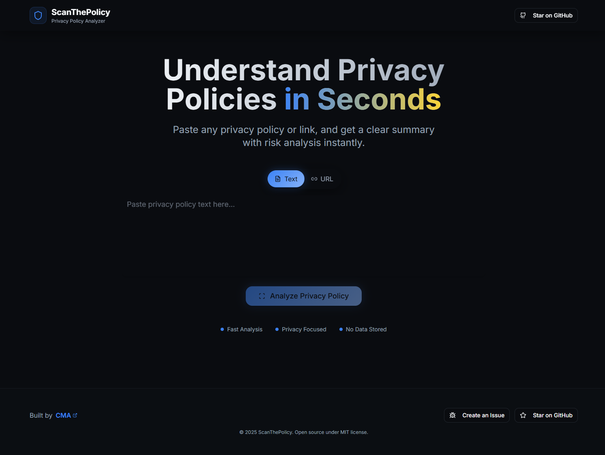
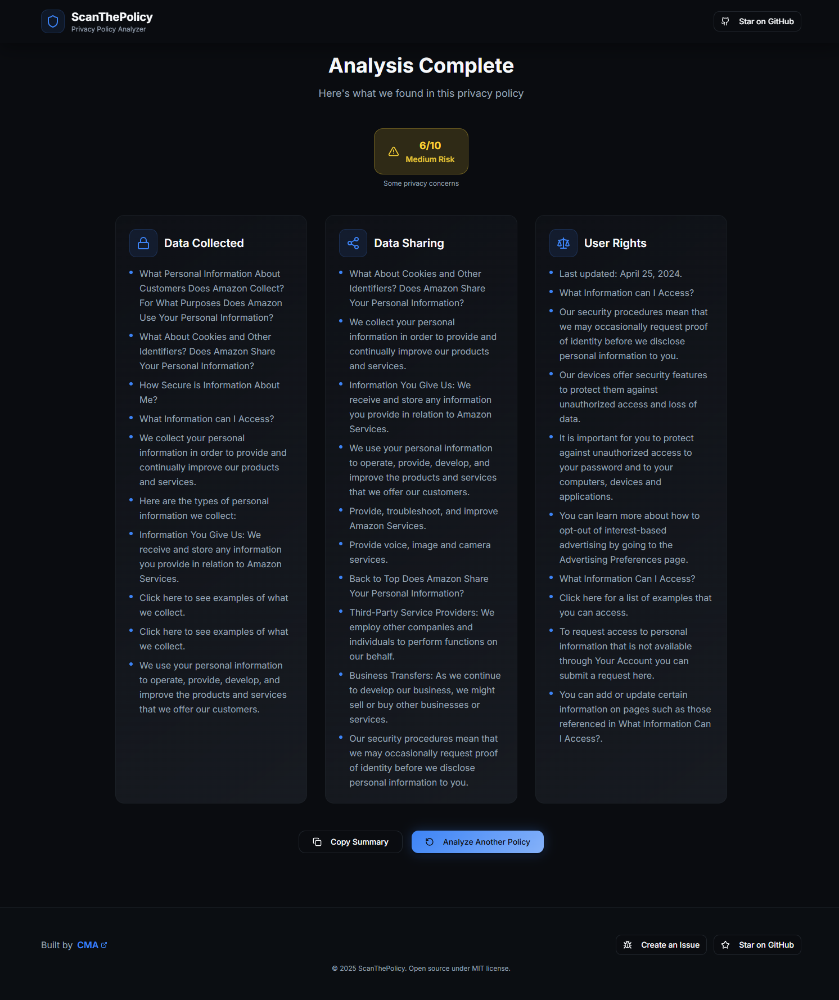
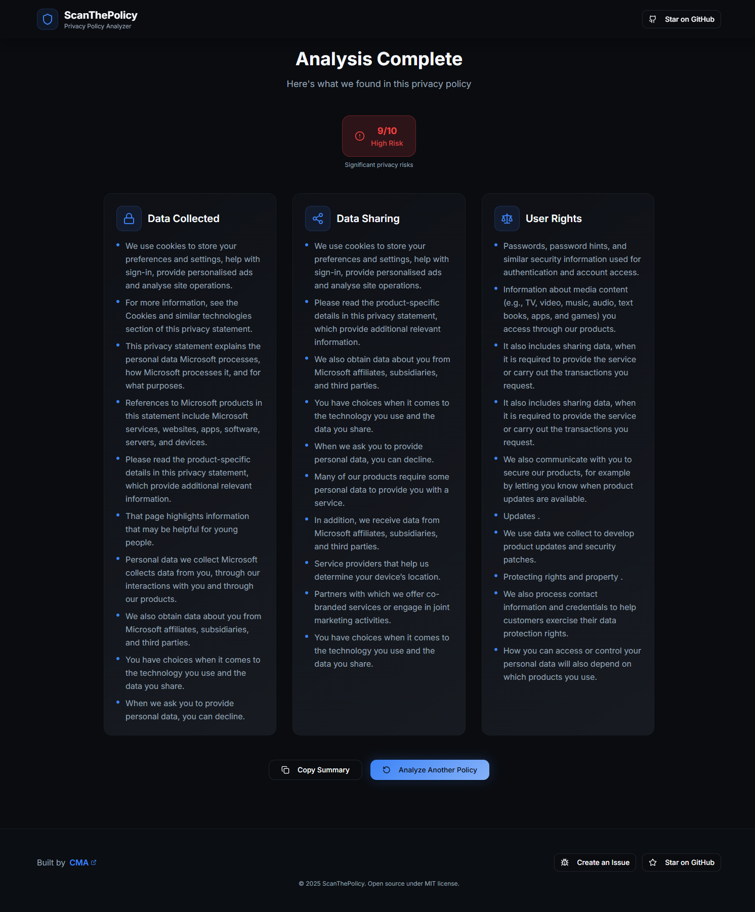

# ScanThePolicy

**Instantly understand privacy policies and terms of service.**

---


## 🚀 Features
- Summarizes privacy policies into actionable highlights
- Assigns a privacy risk score
- Supports both text and URL input
- Beautiful Vite/React frontend
- FastAPI backend with NLP and summarization

---

## � Screenshots
<p align="center">
	
</p>
<p align="center">
	
</p>
<p align="center">
	
</p>

---

## �🖥️ Local Installation & Usage

### Prerequisites
- Python 3.10+
- Node.js 18+
- Git

### 1. Clone the Repository
```bash
git clone https://github.com/chrismat-05/ScanThePolicy.git
cd ScanThePolicy
```

### 2. Backend Setup (FastAPI)
```bash
cd apps/backend
python3 -m venv venv
source venv/bin/activate  # On Windows: venv\Scripts\activate
pip install --upgrade pip
pip install -r requirements.txt
python -m spacy download en_core_web_sm
uvicorn main:app --reload
```
- The backend will run at `http://127.0.0.1:8000`

### 3. Frontend Setup (Vite/React)
```bash
cd apps/frontend
npm install
npm run dev
```
- The frontend will run at `http://localhost:8080`

### 4. Connect Frontend to Backend
- By default, the frontend expects the backend at `http://localhost:8000/api/summarize`.
- If you change ports, update the API URL in your frontend code.

---

## 📝 Usage Instructions
1. Start both backend and frontend servers as above.
2. Open your browser at `http://localhost:8080`.
3. Paste a privacy policy or URL, click **Analyze**.
4. View highlights, risk score, and category breakdowns.

---

## 🛠️ Troubleshooting
- **spaCy model error?** Run: `python -m spacy download en_core_web_sm`
- **Port conflicts?** Change the port in backend/frontend and update API URL accordingly.
- **Missing dependencies?** Run `pip install -r requirements.txt` and `npm install` in the respective folders.

---

## 💡 Contributing
Pull requests and issues are welcome! Please open an issue for bugs or feature requests.

---


## 📄 License
This project is licensed under the [MIT License](LICENSE).

---

## 🤝 Contributing
See [CONTRIBUTING.md](CONTRIBUTING.md) for guidelines.

---

## ✨ Credits
- Built by [chrismat-05](https://github.com/chrismat-05)
- NLP powered by spaCy and sumy
- UI powered by Vite, React, and Tailwind CSS

---


## 🌐 Links
- [GitHub Repo](https://github.com/chrismat-05/ScanThePolicy)
- [CMA](https://thecma.xyz)

---

## 🙏 Thanks for checking out ScanThePolicy!
